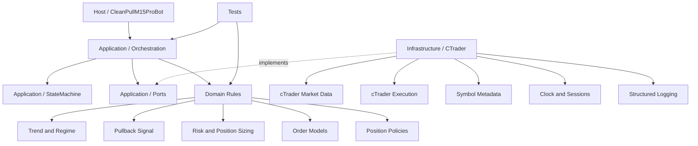

# راهنمای ساخت CleanPull M15 Pro برای cTrader با OpenCode

## 1) تصمیم‌های اصلی

- **زبان و پلتفرم:** C# و cTrader Algo/Automate
- **محیط توسعه:** VS Code + .NET SDK + افزونه C#
- **نوع معماری:** یک پروژه cBot قابل انتشار، با ماژول‌های داخلی مستقل و قابل‌آزمایش
- **خروجی نهایی:** فایل `.algo` حاصل از Build در حالت Release
- **محدوده این پکیج:** ساختار، مستندات و پرامپت‌ها؛ بدون نوشتن منطق نهایی ربات
- **اصل مهم:** هیچ پارامتر، قانون معاملاتی یا رفتار مبهمی حدس زده نشود.

> دلیل انتخاب «یک پروژه قابل انتشار با ماژول‌های داخلی»: خروجی cTrader ساده می‌ماند، ولی منطق استراتژی از API پلتفرم جدا می‌شود و قابلیت تست حفظ می‌گردد.

## 2) نقشه راه

### فاز 0 — تثبیت مشخصات

1. PDF مرجع را به `docs/specification.md` تبدیل کنید.
2. همه قوانین را در `docs/traceability-matrix.md` شماره‌گذاری کنید.
3. ابهام‌ها را در `docs/open-questions.md` ثبت کنید.
4. تا وقتی ابهام مؤثر بر معامله حل نشده، آن قابلیت باید **Fail Closed** باشد؛ یعنی سفارش جدید ایجاد نکند.

**خروجی:** مشخصات قابل‌ردیابی، بدون کد معاملاتی.

### فاز 1 — Bootstrap پروژه

1. ساخت Solution و پروژه Class Library.
2. افزودن پکیج `cTrader.Automate`.
3. ساخت پروژه تست.
4. ایجاد پوشه‌های معماری.
5. اجرای Build اولیه.

**خروجی:** اسکلت پروژه‌ای که Build می‌شود، بدون منطق اضافه.

### فاز 2 — قراردادها و مدل‌های دامنه

مدل‌های حداقلی مانند جهت معامله، وضعیت ربات، نتیجه ارزیابی، ReasonCode، اطلاعات نماد، Snapshot بازار و قرارداد ساعت/اجرا تعریف شوند.

**قید:** هر type باید مصرف‌کننده مشخص داشته باشد؛ type آینده‌نگر ممنوع است.

### فاز 3 — داده و اندیکاتورها

- اعتبارسنجی داده‌های H1 و M15
- استفاده فقط از کندل کاملاً بسته‌شده
- Warm-up طبق مشخصات
- EMA، ATR، RSI و ADX با روش محاسباتی تعیین‌شده
- جلوگیری از Look-ahead

### فاز 4 — Trend و Regime

- فیلتر روند H1
- VolatilityRatio در M15
- خروجی صریح: Buy، Sell یا Neutral
- Neutral باید مانع سفارش جدید شود.

### فاز 5 — سیگنال Pullback

- شرایط BUY و SELL
- CLV، Body، EMA، RSI و ADX
- فیلتر Tick Volume
- فیلتر Spread
- Swing تأییدشده

هر رد شدن باید `ReasonCode` مشخص داشته باشد.

### فاز 6 — ریسک و اندازه موقعیت

- ریسک هر معامله
- محدودیت ریسک رزروشده
- محدودیت XAUUSD + XAGUSD
- محدودیت جهت USD
- Daily/Weekly lock
- High-Water Mark و Kill Switch
- محاسبه حجم با TickValue، Commission و Slippage مطابق مشخصات

**قید:** در داده ناقص، حجم نامعتبر یا Margin ناکافی، معامله رد شود.

### فاز 7 — ساخت و اجرای سفارش

- Buy Stop / Sell Stop
- Entry، SL، TP، Expiry
- Tick rounding
- Stop Level و Freeze Level
- کنترل Trigger-time
- ثبت پاسخ Broker

**قید:** منطق Broker فقط در لایه Infrastructure باشد.

### فاز 8 — مدیریت موقعیت

- Break-even فقط مطابق مدل انتخاب‌شده
- Time exit
- مدیریت رویدادهای Fill/Cancel/Expire/Close
- عدم جابه‌جایی SL به شکل دلخواه یا خارج از مشخصات

### فاز 9 — State، Reconciliation و Logging

State machine:

`DISABLED → READY → SIGNAL_FOUND → ORDER_PENDING → POSITION_OPEN → COOLDOWN`

و از هر وضعیت در صورت اختلاف:

`ANY → RECONCILIATION_REQUIRED`

تصمیم‌ها، Rejectها، Fill، Spread، Slippage، Risk و تغییر وضعیت باید لاگ ساخت‌یافته داشته باشند.

### فاز 10 — تست و Build

در محدوده انتخاب‌شده، حداقل دروازه انتشار:

1. `dotnet restore`
2. `dotnet build --configuration Release`
3. صفر خطای Build
4. بررسی وجود فایل `.algo`

افزودن Test یا Backtest تنها با درخواست صریح انجام شود.

### فاز 11 — Release Review و رفع خودکار

Agent پیش از انتشار باید:

1. تغییرات را با مشخصات تطبیق دهد.
2. کد مرده، abstraction بی‌مصرف و قابلیت خارج از دامنه را حذف کند.
3. Look-ahead، استفاده از کندل جاری، ریسک Fail-open و خطای rounding را بررسی کند.
4. Build Release اجرا کند.
5. اگر ایراد قابل‌رفع است، حداقل تغییر لازم را اعمال کند.
6. دوباره از مرحله 1 بررسی کند.
7. فقط پس از عبور همه Gateها فایل `.algo` را در `artifacts/release/` کپی کند.
8. اگر Gate حل نشد، انتشار را متوقف کند و گزارش دقیق بدهد.

### فاز 12 — Polish نهایی

Polish مجاز است فقط:

- نام‌گذاری و خوانایی را بهتر کند.
- تکرار واقعی را حذف کند.
- پیام خطا و لاگ را روشن‌تر کند.
- مستندات را با رفتار واقعی هماهنگ کند.
- هشدارهای Build را در صورت امکان بدون تغییر رفتار رفع کند.

Polish نباید feature جدید، اندیکاتور جدید، پارامتر جدید یا refactor گسترده ایجاد کند.

## 3) ساختار پروژه پیشنهادی

```text
CleanPullM15Pro/
├── AGENTS.md
├── README.md
├── opencode.json
├── CleanPullM15Pro.sln
├── Directory.Build.props
├── docs/
│   ├── architecture.md
│   ├── roadmap.md
│   ├── specification.md
│   ├── traceability-matrix.md
│   ├── open-questions.md
│   ├── quality-gates.md
│   └── release-checklist.md
├── src/
│   └── CleanPullM15Pro/
│       ├── CleanPullM15Pro.csproj
│       ├── Host/
│       │   └── CleanPullM15ProBot.cs
│       ├── Application/
│       │   ├── Orchestration/
│       │   ├── StateMachine/
│       │   └── Ports/
│       ├── Domain/
│       │   ├── Market/
│       │   ├── Indicators/
│       │   ├── Trend/
│       │   ├── Signals/
│       │   ├── Risk/
│       │   ├── Orders/
│       │   └── Positions/
│       └── Infrastructure/
│           └── CTrader/
│               ├── MarketData/
│               ├── Execution/
│               ├── Symbols/
│               ├── Clock/
│               └── Logging/
├── tests/
│   └── CleanPullM15Pro.Tests/
├── artifacts/
│   └── release/
├── scripts/
│   ├── verify-build.ps1
│   └── publish-algo.ps1
└── .opencode/
    ├── agents/
    │   ├── architect.md
    │   ├── implementer.md
    │   ├── reviewer.md
    │   └── release-manager.md
    └── commands/
        ├── bootstrap.md
        ├── layer-domain.md
        ├── layer-data.md
        ├── layer-signal.md
        ├── layer-risk.md
        ├── layer-execution.md
        ├── layer-state.md
        ├── verify.md
        ├── polish.md
        └── release.md
```

## 4) دیاگرام معماری فایل‌ها



### قانون وابستگی

- `Domain` نباید به `cAlgo.API` وابسته باشد.
- `Application` فقط از Domain و Portها استفاده می‌کند.
- `Infrastructure` Portها را با cTrader پیاده می‌کند.
- `Host` فقط lifecycle پلتفرم را به Application متصل می‌کند.
- هیچ پوشه‌ای صرفاً برای «شاید بعداً لازم شود» ساخته نشود.

## 5) نقش فایل‌های مهم

| فایل | وظیفه |
|---|---|
| `AGENTS.md` | قوانین ثابت پروژه برای همه Agentها؛ نام صحیح در OpenCode جمع است. |
| `README.md` | نصب، Build، اجرای cBot و محدودیت‌های پروژه. |
| `opencode.json` | مجوزها و رفتار Agentها در سطح پروژه. |
| `docs/specification.md` | نسخه ساختاریافته و بدون ابهام مشخصات PDF. |
| `docs/traceability-matrix.md` | نگاشت Rule → Code → Test → Status. |
| `docs/open-questions.md` | ابهام‌هایی که Agent حق حدس‌زدنشان را ندارد. |
| `docs/quality-gates.md` | شروط عبور از هر فاز. |
| `docs/release-checklist.md` | شروط انتشار فایل `.algo`. |
| `.opencode/agents/reviewer.md` | بازبینی مستقل و بدون ویرایش. |
| `.opencode/agents/release-manager.md` | Review → Fix → Rebuild → Publish. |
| `.opencode/commands/release.md` | فرمان نهایی انتشار کنترل‌شده. |

## 6) پرامپت شروع

```text
این مخزن مربوط به CleanPull M15 Pro برای cTrader است. ابتدا AGENTS.md، README.md،
docs/architecture.md، docs/specification.md، docs/traceability-matrix.md و
docs/open-questions.md را کامل بخوان.

پیش از تغییر فایل‌ها:
1) هدف دقیق این مرحله را در حداکثر 5 خط خلاصه کن.
2) Rule IDهای مرتبط را اعلام کن.
3) کوچک‌ترین مجموعه فایل‌های لازم را مشخص کن.
4) اگر قانون مؤثر بر معامله مبهم است، کدنویسی آن بخش را متوقف و سؤال را ثبت کن.

قوانین اجرا:
- فقط محدوده درخواست‌شده را پیاده‌سازی کن.
- پارامتر، fallback یا feature جدید اختراع نکن.
- abstraction، interface، helper یا فایل بدون مصرف‌کننده فعلی نساز.
- Domain را از cAlgo.API مستقل نگه دار.
- فقط از کندل بسته‌شده استفاده کن مگر مشخصات صریحاً خلاف آن را بگوید.
- رفتار ناقص یا نامطمئن باید Fail Closed باشد.
- پس از تغییر، Build مرتبط را اجرا و خطاهای ناشی از تغییر خودت را رفع کن.
- در پایان فایل‌های تغییرکرده، Rule IDها، فرمان‌های اجراشده و موارد حل‌نشده را گزارش کن.
```

## 7) الگوی مشترک پرامپت هر لایه

ابتدای همه پرامپت‌های لایه‌ای این بلوک قرار گیرد:

```text
Scope Lock:
- فقط لایه و Rule IDهای اعلام‌شده را تغییر بده.
- هر چیزی خارج از Scope را در گزارش «Not implemented by design» بنویس؛ کدش را نساز.
- قبل از افزودن هر type یا فایل بپرس: مصرف‌کننده فعلی آن کجاست؟ اگر مصرف‌کننده ندارد، نساز.
- از TODO اجرایی، mock production، مقدار جادویی و catch خالی استفاده نکن.
- تغییر عمومی یا refactor نامرتبط ممنوع است.
```

و انتهای همه آن‌ها:

```text
Definition of Done:
1) رفتار با Rule IDها قابل‌ردیابی است.
2) هیچ وابستگی معکوس معماری ایجاد نشده است.
3) Build موفق است.
4) کد مرده، قابلیت اضافه و هشدار جدید ایجاد نشده است.
5) یک Self-review روی diff انجام شده و ایرادهای پیدا‌شده رفع شده‌اند.
6) گزارش کوتاه شامل تغییرات، بررسی‌ها و محدودیت‌ها ارائه شده است.
```

## 8) پرامپت‌های موردنیاز هر لایه

### Domain

```text
فقط مدل‌ها و قواعد خالص Domain مربوط به Rule IDهای درخواست‌شده را ایجاد کن.
هیچ ارجاعی به cAlgo.API، فایل، شبکه، ساعت سیستم یا Broker نداشته باش.
مدل‌ها immutable و واحدها در نام یا type روشن باشند. از hierarchy و genericهای
غیرضروری خودداری کن. برای هر قانون یک خروجی صریح Accepted/Rejected با ReasonCode بده.
```

### Data و Indicators

```text
ورودی H1/M15، warm-up، ترتیب زمانی و closed-bar indexing را طبق مشخصات پیاده‌سازی کن.
Look-ahead و استفاده تصادفی از کندل جاری ممنوع است. فرمول indicatorها را حدس نزن.
در NaN، کمبود تاریخچه، timestamp نامعتبر یا gap مؤثر، نتیجه DataInvalid و بدون سفارش باشد.
```

### Signal

```text
فقط Trend، Volatility، Pullback، Momentum، Volume، Spread و Swing تعریف‌شده در
Rule IDهای این مرحله را ترکیب کن. ترتیب ارزیابی deterministic باشد. اولین رد معتبر
ReasonCode مشخص تولید کند. شرط جایگزین یا «بهبوددهنده» اضافه نکن.
```

### Risk

```text
Risk per trade، exposure، reserved risk، drawdown lock، margin و حجم را دقیقاً طبق
مشخصات محاسبه کن. rounding حجم و قیمت باید با Symbol metadata انجام شود. در صفر یا
نامعتبر بودن TickValue، SL distance، Equity یا LotStep معامله رد شود. هرگز برای عبور
از محدودیت‌ها مقدار را خوش‌بینانه clamp نکن مگر مشخصات صریحاً گفته باشد.
```

### Execution

```text
Application Portهای موجود را با cTrader API پیاده‌سازی کن. Entry/SL/TP/Expiry و
Broker response را مدیریت کن. منطق استراتژی را داخل adapter قرار نده. قبل از ارسال،
StopLevel، FreezeLevel، TradingHours، Spread و trigger-time validation را اجرا کن.
در پاسخ مبهم Broker سفارش موفق فرض نشود.
```

### State و Reconciliation

```text
فقط transitionهای مستند را مجاز کن. هر mismatch میان state داخلی و Broker باید به
RECONCILIATION_REQUIRED برود و سفارش جدید را متوقف کند. transition پنهان، بازیابی
خوش‌بینانه و reset خودکار Kill Switch ممنوع است. همه transitionها ReasonCode و log دارند.
```

## 9) پرامپت Verify

```text
بدون افزودن feature جدید، وضعیت فعلی مخزن را بررسی کن.
1) dotnet restore را اجرا کن.
2) dotnet build --configuration Release را اجرا کن.
3) خطاهایی را که با کوچک‌ترین تغییر قابل‌رفع‌اند اصلاح کن.
4) Build را تکرار کن تا موفق شود یا blocker واقعی مشخص شود.
5) وجود فایل .algo را بررسی کن.
6) اگر Build موفق نیست، انتشار را ممنوع اعلام کن.
فقط فایل‌های لازم برای رفع خطا را تغییر بده و refactor جانبی انجام نده.
```

## 10) پرامپت Release با Review و Fix خودکار

```text
این فرمان یک Release Gate است، نه درخواست feature.

مرحله A — Review مستقل:
- diff و فایل‌های مرتبط را با specification و traceability matrix مقایسه کن.
- Look-ahead، current-bar misuse، واحدهای قیمت/پیپ/حجم، rounding، Fail-open،
  race/event ordering، state mismatch و API misuse را بررسی کن.
- کد مرده، abstraction بی‌مصرف، duplication و تغییر خارج از Scope را پیدا کن.

مرحله B — Fix:
- ایرادهای قطعی و قابل‌رفع را با کوچک‌ترین patch اصلاح کن.
- برای رفع ایراد feature جدید نساز و پارامتر معاملاتی را تغییر نده.
- اگر رفع ایراد نیازمند تصمیم معاملاتی مبهم است، انتشار را متوقف کن.

مرحله C — Re-review:
- diff جدید را دوباره از ابتدا بررسی کن.
- چرخه Review/Fix را حداکثر 3 بار انجام بده؛ loop بی‌پایان ممنوع است.

مرحله D — Build Gate:
- dotnet restore
- dotnet build --configuration Release
- تأیید صفر خطای Build
- تأیید تولید دقیقاً یک artifact موردانتظار

مرحله E — Publish:
- فقط پس از عبور همه Gateها فایل .algo را در artifacts/release قرار بده.
- source، bin/obj، log یا فایل موقت را منتشر نکن.
- checksum و گزارش Release را ثبت کن.

اگر هر Gate شکست خورد:
- artifact قبلی را به‌عنوان خروجی جدید معرفی نکن.
- انتشار را متوقف کن.
- blocker، فایل و اقدام لازم را دقیق گزارش کن.
```

## 11) پرامپت Polish نهایی

```text
یک Polish محدود و بدون تغییر رفتار انجام بده:
- نام‌های مبهم، پیام‌های خطا و logها را روشن کن.
- duplication واقعی و کد مرده را حذف کن.
- usingها، formatting و هشدارهای ساده را پاک‌سازی کن.
- README و traceability را با رفتار واقعی هماهنگ کن.

ممنوع:
- feature، indicator، parameter یا dependency جدید
- تغییر فرمول یا threshold
- refactor گسترده
- تغییر public contract بدون ضرورت Build

پس از Polish، diff را برای تغییر رفتار ناخواسته بررسی و Build Release را اجرا کن.
اگر تغییر رفتار محتمل است، آن تغییر را revert کن.
```

## 12) ترتیب استفاده در OpenCode

1. فایل PDF را در `docs/reference/` قرار دهید.
2. OpenCode را در ریشه پروژه اجرا کنید.
3. ابتدا `/bootstrap` را اجرا کنید.
4. مشخصات و سؤال‌های باز را بررسی و تأیید کنید.
5. لایه‌ها را به ترتیب Domain → Data → Signal → Risk → Execution → State اجرا کنید.
6. بعد از هر لایه `/verify` اجرا کنید.
7. در پایان `/polish` اجرا کنید.
8. آخرین فرمان `/release` است.

## 13) چک‌لیست جلوگیری از کد اضافه

قبل از پذیرش هر تغییر:

- آیا این فایل یک نیاز فعلی و Rule ID دارد؟
- آیا type جدید هم‌اکنون مصرف می‌شود؟
- آیا همان رفتار با کد ساده‌تر ممکن است؟
- آیا dependency جدید واقعاً ضروری است؟
- آیا Agent چیزی را برای «آینده» ساخته است؟
- آیا threshold یا fallback جدیدی اختراع شده است؟
- آیا تغییر نامرتبط وارد diff شده است؟

اگر پاسخ نامناسب است، تغییر حذف شود؛ ربات معاملاتی جای مناسبی برای «شاید بعداً به درد بخورد» نیست.

## 14) منابع فنی

- cTrader: پروژه cBot در IDE خارجی یک Class Library است، به `cTrader.Automate` نیاز دارد و Build موفق فایل `.algo` تولید می‌کند.
- OpenCode: دستورالعمل ثابت پروژه در `AGENTS.md` قرار می‌گیرد؛ Agentهای پروژه در `.opencode/agents/` و Commandها در `.opencode/commands/` تعریف می‌شوند.
